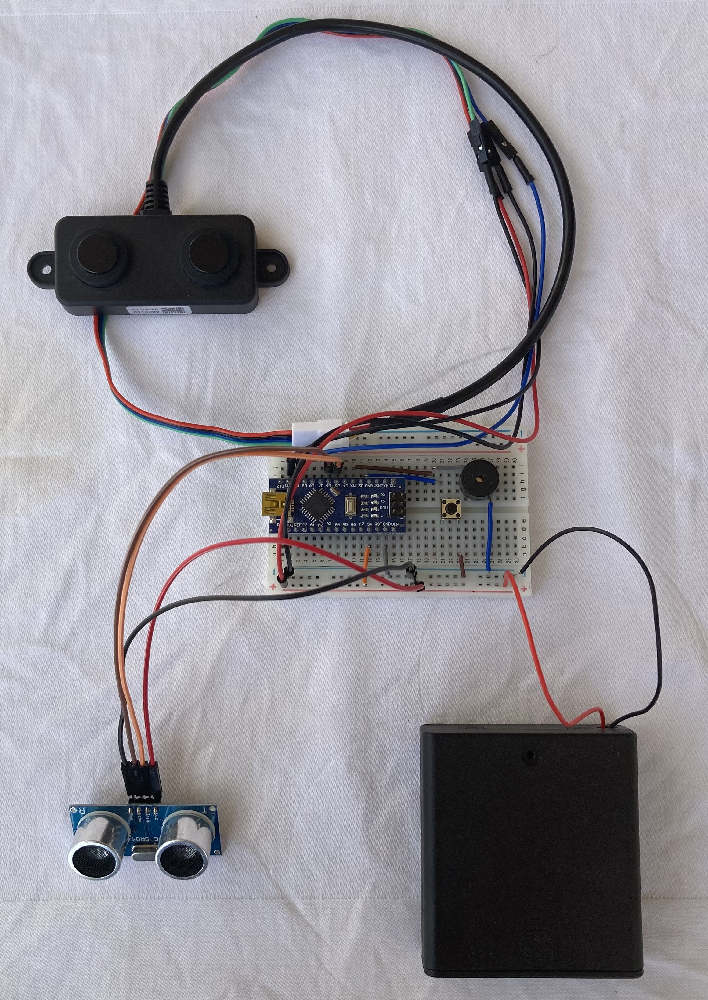
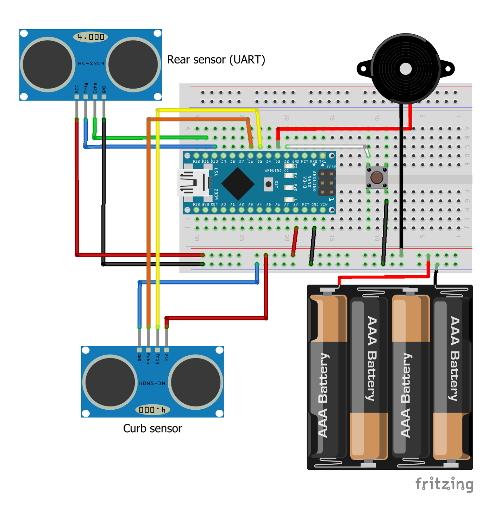

# Parking Assist System

Reverse-activated ultrasonic parking assist system with adaptive acoustic warning, multi-sensor input and filtered distance measurement.

---

## Overview

This project implements a simplified automotive-style parking assist system using ultrasonic sensors and an acoustic warning system.

The system continuously measures the distance behind the vehicle and provides adaptive acoustic feedback to the driver. The warning frequency increases as the distance to an obstacle decreases, mimicking real-world parking assist systems.

In addition to the primary rear sensor, a secondary downward-facing ultrasonic sensor is used for curb detection. This enables detection of low obstacles that may not be visible from the driver’s perspective and introduces a high-priority safety layer through an audio override mechanism.

The project is being developed as a rapid prototype on Arduino Nano, with a long-term goal of migrating to STM32 and extending the system towards a more realistic automotive-grade architecture.

---

## Features

- UART-based ultrasonic distance measurement (A02YYUW)
- Real-time distance processing
- Distance-based adaptive acoustic warning
- Passive buzzer audio output using non-blocking tone control
- Centralized audio control supporting multi-sensor and fault-specific patterns
- Moving average filtering for stable distance measurement
- Hysteresis-based distance zones for stable behavior
- Reverse activation simulated using push button input
- State machine-based control flow (IDLE / ACTIVE / FAULT)
- Non-blocking timing using `millis()`
- Packet validation using checksum
- Timeout-based safety handling
- Structured fault detection framework (extensible for multiple fault types)
- Invalid sensor packet fault detection
- Fault-specific acoustic warning patterns
- Dirty sensor fault detection based on measurement instability
- Dual-sensor system (rear + curb detection)
- High-priority audio override for critical low obstacles
- Stabilized curb detection using hysteresis and timing

---

## Hardware

- Arduino Nano
- Waterproof ultrasonic sensor (A02YYUW / A0221AU)
- HC-SR04 ultrasonic sensor (curb detection)
- Passive buzzer
- Push button (reverse activation simulation)
- Breadboard and jumper wires

---

## Hardware Setup

<p align="center">
  
</p>
<p align="center">
  <em>Figure: Dual-sensor prototype setup with rear (UART) and curb (HC-SR04) detection</em>
</p>

---

## Wiring

### Ultrasonic Sensor (UART)

| Sensor Wire | Arduino |
|------------|--------|
| Red (VCC)  | 5V     |
| Black (GND)| GND    |
| Blue (TX)  | D10    |
| Green (RX) | D11    |

### Buzzer

| Buzzer Pin | Arduino |
|-----------|--------|
| +         | D3     |
| -         | GND    |

### Reverse Simulation Button

| Button Pin | Arduino |
|-----------|--------|
| 1 side    | D2     |
| 1 side    | GND    |

### Curb Detection Sensor (HC-SR04)

| Sensor Pin | Arduino |
|-----------|--------|
| VCC       | 5V     |
| GND       | GND    |
| TRIG      | D5     |
| ECHO      | D6     |

---

## Wiring Diagram

<p align="center">
  
</p>
<p align="center">
  <em>Figure: Wiring diagram for dual-sensor prototype</em>
</p>

> Note: The diagram uses generic components for visualization.  
> The actual system uses a UART-based ultrasonic sensor (A02YYUW) for rear distance measurement and an HC-SR04 sensor for curb detection.
>
> The system is powered using a 4x AA battery pack (~4.8V) during prototyping.  
> During development, the system may also be powered via USB, but both power sources should not be used simultaneously.

---

## System Behavior

The system operates in real time:

- The rear ultrasonic sensor continuously sends distance data via UART
- The Arduino parses incoming packets and validates them using checksum
- Distance is filtered and mapped to warning zones
- The passive buzzer generates acoustic feedback based on proximity
- A secondary ultrasonic sensor monitors low obstacles (curb detection)
- The system is active only when reverse input is enabled

### Warning Zones (Rear Sensor)

| Distance (cm) | Behavior        |
|--------------|----------------|
| > 100        | No sound       |
| 60–100       | Slow beeping   |
| 40–60        | Medium beeping |
| 20–40        | Fast beeping   |
| < 20         | Continuous tone|

### Curb Detection Behavior

- The curb sensor operates as a high-priority safety layer
- It does not generate continuous distance-based warnings
- Instead, it triggers a high-priority acoustic alert when a critical threshold is reached

**Curb activation threshold:**
- < 35 cm → high-priority alert (audio override)

**Behavior:**
- Overrides normal rear sensor audio
- Generates a distinct high-frequency pulsed alert
- Uses hysteresis and timing to prevent flickering

---

## Control Logic

The system is only active when reverse gear is engaged.

For development and testing purposes, reverse activation is simulated using a push button input (active LOW).

When reverse is not active:
- Sensor data is ignored
- Audio output is disabled

---

## Software Architecture

The system is structured into several logical layers:

- **Data acquisition** – reading UART packets from the primary sensor and triggering measurements on the secondary ultrasonic sensor  
- **Processing** – validating, filtering and converting distance data, including moving average filtering and invalid reading handling  
- **Decision logic** – distance-based zone selection with hysteresis for the rear sensor and threshold-based detection for curb events  
- **Audio control** – centralized buzzer control using non-blocking timing, supporting multiple sound patterns and priority-based overrides  
- **State control** – system-level mode handling (IDLE / ACTIVE / FAULT) implemented using a state machine  

### Multi-Sensor Design

The system uses a dual-sensor architecture with distinct roles:

- The **primary rear sensor** provides continuous distance measurement and zone-based warning
- The **secondary curb sensor** acts as a high-priority safety layer and triggers an emergency audio override when a critical threshold is reached

This separation allows the system to remain robust despite differences in sensor reliability and behavior.

### Design Principles

- Separation of sensing, decision logic, and output layers  
- Non-blocking system behavior using `millis()` where possible  
- Prioritized decision flow (fault > curb > rear)  
- Minimal reliance on unreliable measurements (curb sensor used only for critical events)   

---

## Communication Protocol

The sensor sends 4-byte packets:

```
[0] 0xFF -> Start byte
[1] High byte -> Distance (MSB)
[2] Low byte -> Distance (LSB)
[3] Checksum -> (byte0 + byte1 + byte2) & 0xFF
```


Distance is converted to centimeters:
```
distance = ((high_byte << 8) + low_byte) / 10
```

---

## Safety Features

- **Checksum validation** ensures data integrity  
- **Timeout monitoring**  detects loss of valid sensor communication
- **Fault-specific warning patterns** provide audible fault feedback
- **Reverse-controlled operation** prevents continuous system activity outside reverse mode

---

## Known Limitations (Prototype Stage)

- The system uses SoftwareSerial for communication with the primary ultrasonic sensor, which is sensitive to timing interference from audio generation
- Long-duration or complex audio patterns can disrupt UART reception on Arduino Nano
- As a result, the dirty sensor acoustic pattern is temporarily disabled

- The secondary HC-SR04 sensor uses blocking `pulseIn()` for distance measurement
- This introduces timing jitter and may affect overall system responsiveness

These limitations are expected to be resolved in future versions by migrating to STM32 with hardware UART and non-blocking sensor acquisition.

---

## Current Status

**V7 – Dual-sensor system with curb detection and stabilized alert logic**

- Distance measurement 
- Filtering
- Hysteresis 
- Passive buzzer audio control
- Reverse activation
- State machine control
- Timeout fault detection
- Invalid packet fault detection
- Dirty sensor fault detection
- Fault-specific acoustic warning
- Secondary ultrasonic sensor (HC-SR04)
- Curb detection with emergency override
- Anti-flicker stabilization

---

## Future Improvements
   
- Robust dirty sensor audio signaling without interference on the prototype platform
- Replace blocking curb sensor reading with non-blocking implementation
- IMU-based tilt-aware warning logic
- Migration from Arduino Nano to STM32
- CAN-based vehicle communication

---

## Disclaimer

This project is for educational and prototyping purposes only and is not intended for use in safety-critical automotive systems.

---

## License

This project is licensed under the MIT License.